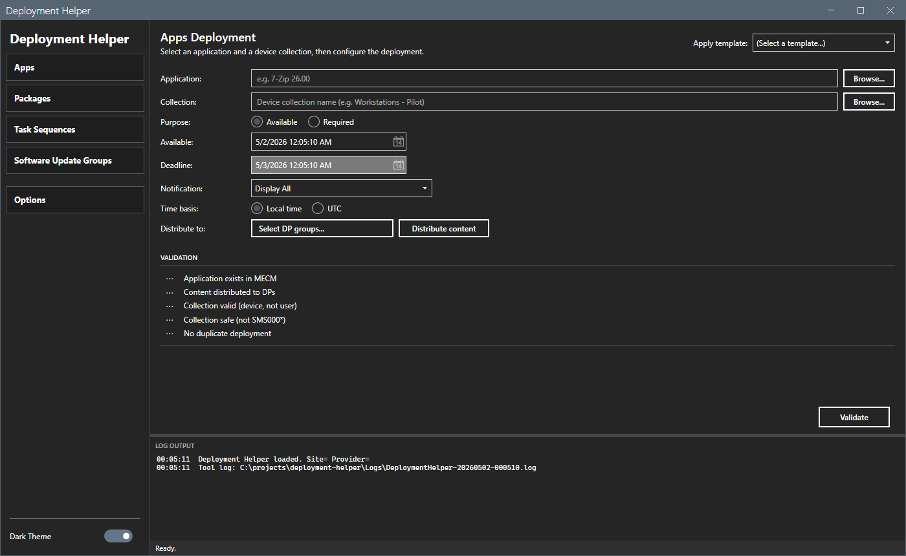

# Deployment Helper

Safe MECM deployment for Applications, Packages, Task Sequences, and Software Update Groups with pre-execution validation, safety guardrails, and immutable audit logging.

## Features

- Unified deployment workflow for Apps, Packages, Task Sequences, and Software Update Groups
- Search dialogs for target object and target collection (filtered DataGrid results)
- Distribution point group picker with per-group status
- Five-check pre-execution validation (target exists, content distributed, collection valid, collection safe, no duplicate deployment)
- SMS-built-in collection guardrail: every `SMS000*` collection is blocked
- Purpose + schedule sanity: block inverted deadlines, warn on backdated Available, block `Available + HideAll` silent-noop combo
- Per-type option surfaces: Required extras (Override MW / Allow restart / Metered) on Apps; Packages network + rerun behavior; Task Sequence availability; SUG fallback + post-reboot scan
- Deployment templates with a first-run seed of four defaults (Workstation Pilot/Production, Server Pilot/Production)
- Themed confirmation dialogs on every destructive step
- Immutable JSONL audit log (append-only, one record per deployment attempt)
- CSV + HTML history export
- Dark and light themes with runtime toggle

## Requirements

- PowerShell 5.1
- .NET Framework 4.8 or later
- Configuration Manager admin console installed locally
- MECM role permissions sufficient for application, package, task sequence, and software update deployment

## Install

On first launch, open **Options > Connection** and set the site code + SMS Provider FQDN, then use the sidebar to pick a deployment type. Four default deployment templates are written to the `Templates\` folder automatically.

## Templates

On first run, four default templates are written to `Templates\`:

- Workstation Pilot (Available, Display in Software Center)
- Workstation Production (Required, Display All)
- Server Pilot (Available, Display in Software Center)
- Server Production (Required, Hide All)

Edit, duplicate, or delete via **Options > Templates**. Each template is a simple JSON file; edits survive app restarts.

## Files written on disk

| File | Purpose |
|------|---------|
| `DeploymentHelper.prefs.json` | Site code, SMS provider, audit log path |
| `DeploymentHelper.windowstate.json` | Window size, position, theme, last-used deployment type |
| `Logs\DeploymentHelper-*.log` | Per-session tool log |
| `Logs\deployment-audit.jsonl` | Immutable deployment audit trail |
| `Templates\*.json` | Deployment templates |
| `Reports\*.csv` / `Reports\*.html` | History exports |

## License

MIT. See [LICENSE](LICENSE).
