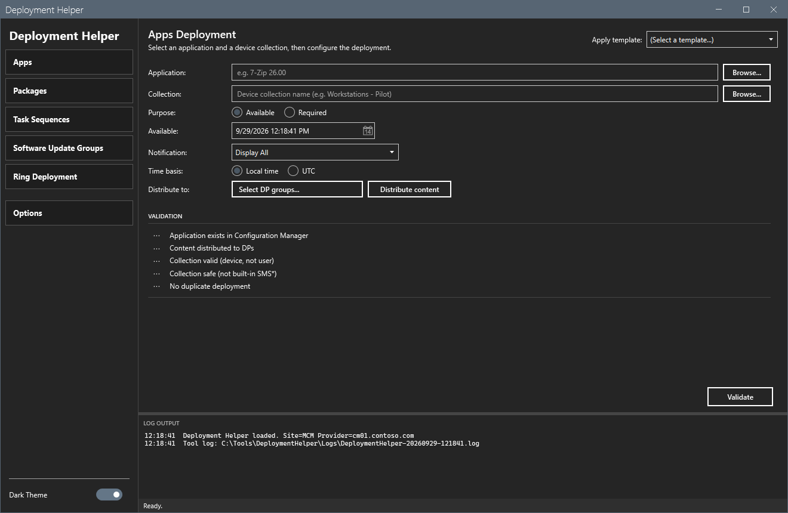

# Deployment Helper

[](https://github.com/jasonulbright/deployment-helper/releases/latest)
[](https://github.com/jasonulbright/deployment-helper/releases)
[](#requirements)
[](LICENSE)

Safe Configuration Manager deployment for Applications, Packages, Task Sequences, and Software Update Groups with pre-execution validation, safety guardrails, and immutable audit logging.



## Features

- Unified deployment workflow for Apps, Packages, Task Sequences, and Software Update Groups
- Browse dialogs for the target object and the target collection: the full list loads in the background, a filter box narrows it as you type, and collections show in their console folder tree (lists are kept for the session; Refresh, or Shift+Browse for collections, reloads)
- Distribution point group picker with per-group status
- Five-check pre-execution validation (target exists, content distributed, collection valid, collection safe, no duplicate deployment)
- Built-in collection guardrail: every collection whose ID starts with `SMS` (including `SMSDM*`) is blocked
- Ring deployments: one object, one ring plan, one deployment per ring, all at once or ring by ring with Promote
- Purpose + schedule sanity: block inverted deadlines, warn on backdated Available, block `Available + HideAll` silent-noop combo
- Per-type option surfaces: Required extras (Override MW / Allow restart / Metered) on Apps; Packages network + rerun behavior; Task Sequence availability; SUG fallback + post-reboot scan
- Deployment templates with a first-run seed of four defaults (Workstation Pilot/Production, Server Pilot/Production)
- Themed confirmation dialogs on every destructive step
- Immutable JSONL audit log (append-only, one record per deployment attempt)
- Fail-closed creates: a deployment is blocked when the duplicate check cannot run or the audit log cannot be written
- CSV + HTML history export
- Dark and light themes with runtime toggle

## Requirements

- PowerShell 5.1
- .NET Framework 4.8 or later
- Configuration Manager admin console installed locally
- Configuration Manager role permissions sufficient for application, package, task sequence, and software update deployment

## Install

On first launch, open **Options > Connection** and set the site code + SMS Provider FQDN, then use the sidebar to pick a deployment type. Four default deployment templates are written to the `Templates\` folder and two ring plans to the `Rings\` folder automatically.

## Templates

On first run, four default templates are written to `Templates\`:

- Workstation Pilot (Available, Display in Software Center)
- Workstation Production (Required, Display All)
- Server Pilot (Available, Display in Software Center)
- Server Production (Required, Hide All)

Edit, duplicate, or delete via **Options > Templates**. Each template is a simple JSON file; edits survive app restarts.

## Ring deployments

A ring plan is a named, ordered list of rings in `Rings\<plan>.json`. Each ring names one device collection by CollectionID, a purpose, and day offsets from the plan start. A ring run makes one ordinary Configuration Manager deployment per ring. The site does not know that the deployments form a sequence; only the tool's files record it.

On first run, two plans are written to `Rings\`: **Workstation-Rings** (QA, Pilot, Prod 1, Prod Final) and **Server-Rings** (Test, Prod). The seed plans name no collection. A plan with an empty ring target does not run.

To run a plan:

1. Select **Ring deployment** in the sidebar.
2. Select the object type, then the object. For a package, select the program.
3. Select the plan and the plan start. Click **Expand** to compute each ring's dates.
4. Set each ring's collection in the preview, or set `CollectionID` in the plan file. Edits in the preview apply to this run only.
5. Click **Validate**. Each ring must pass the five checks and the plan rules.
6. Click **Create deployments**. The confirmation lists every deployment that the run creates.

Plan rules:

- Rings must not share a collection.
- A built-in collection (ID prefix `SMS`) is blocked. A plan file that names one does not load; the log names the ring.
- The deadline of a Required ring must be later than its available time and later than the deadline of the previous Required ring.
- A deadline in the past blocks the run.

For a plan with `"TimeBasedOn": "Utc"`, enter the plan start and every preview time in UTC. The checks compare them with the current UTC time.

### Create all rings at once

This is the default. The tool creates every ring now with future available times and deadlines. Configuration Manager enforces the schedule. If one ring fails, the run stops; the rings created before it stay.

### Hold later rings

Set `"HoldLaterRings": true` in the plan, or select **Hold later rings** before Validate. The tool writes a run file, records ring 1 as creating, then creates it. The other rings stay held.

**Open runs** shows each ring of each open run with live counts from the site: targeted, success, error, and in progress. **Promote** on the next held ring creates it after the five checks run again. Promote reads the run file again first and refuses when the ring is no longer held or another session holds the run lock. If the app stops after starting a create, refresh and reconcile before retrying; the pending ring is adopted when one matching deployment exists, or returned to Held after five minutes with no match. Multiple matches remain blocked until extras are removed.

`SuccessThresholdPercent` on a ring is the success rate that ring must reach before Promote is available for the next ring. Promote never runs by itself.

If the deadline of a held ring has passed when you promote it, Promote moves that ring and every later held ring later by the same amount. The confirmation shows the change.

**Refresh and reconcile** reads live counts. The site summarizes a new deployment on its own schedule; until then the ring shows no counts, and a threshold on it keeps Promote disabled. Reconcile marks a ring **Removed** only when the deployment itself is gone from the site, for example deleted in the console. It moves a finished run to the `closed` subfolder. A read error never marks a ring Removed.

The run-state folder is set in **Options > Logging**. The default is `Rings\runs`. A UNC path lets a team share runs.

### Plan file

```json
{
  "Name": "Workstation-Rings",
  "Description": "Four workstation rings.",
  "HoldLaterRings": false,
  "TimeBasedOn": "LocalTime",
  "Rings": [
    {
      "Name": "QA",
      "CollectionID": "PS100123",
      "Purpose": "Required",
      "AvailableOffsetDays": 0,
      "DeadlineOffsetDays": 1,
      "UserNotification": "DisplayAll",
      "OverrideServiceWindow": false,
      "RebootOutsideServiceWindow": false,
      "AllowMeteredConnection": false,
      "DPGroup": "",
      "SuccessThresholdPercent": 90
    }
  ]
}
```

| Ring field | Values |
|------------|--------|
| `Purpose` | `Available` or `Required` |
| `AvailableOffsetDays`, `DeadlineOffsetDays` | Days after the plan start; decimals allowed. `DeadlineOffsetDays` is required for `Required` rings. |
| `UserNotification` | `DisplayAll`, `DisplaySoftwareCenterOnly`, `HideAll` |
| `OverrideServiceWindow`, `RebootOutsideServiceWindow`, `AllowMeteredConnection` | `true` or `false` |
| `AllowBoundaryFallback`, `AllowMicrosoftUpdate`, `RequirePostRebootFullScan` | Software update groups only |
| `TaskSequenceAvailability`, `ShowTaskSequenceProgress` | Task sequences only |
| `FastNetworkOption`, `SlowNetworkOption`, `RerunBehavior` | Packages only; same values as the Packages view |
| `DPGroup` | DP group that receives the content before this ring's deployment is created (not for software update groups) |
| `SuccessThresholdPercent` | Empty, or 0 to 100 |

Before creating a deployment, the tool checks that the configured audit log can be opened for writing. Every ring deployment then writes one audit record with `PlanName`, `RingIndex`, `RingName`, and `RunId`. If the append still fails after Configuration Manager creates a deployment, the tool reports its ID and stops before creating later rings.

## Files written on disk

| File | Purpose |
|------|---------|
| `DeploymentHelper.prefs.json` | Site code, SMS provider, audit log path, ring run-state folder |
| `DeploymentHelper.windowstate.json` | Window size, position, theme, last-used deployment type |
| `Logs\DeploymentHelper-*.log` | Per-session tool log |
| `Logs\deployment-audit.jsonl` | Immutable deployment audit trail |
| `Templates\*.json` | Deployment templates |
| `Rings\*.json` | Ring plans |
| `Rings\runs\*.json` | Run state of held ring runs (`closed\` holds finished runs); folder set in Options |
| `Reports\*.csv` / `Reports\*.html` | History exports |

## License

MIT. See [LICENSE](LICENSE).
